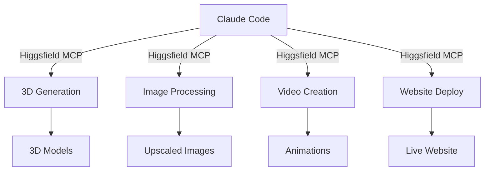

# 🚀 FUTURERA DIGITAL - 3D WEB SİTESİ PROJESİ

## 📋 PROJE ÖZETİ

**Proje Adı:** Futurera Digital 360° Space-Themed 3D Web Portal  
**İstemci:** Futurera Digital (Digital Marketing & Construction Focus Agency)  
**Dil:** Turkish (TR) + English (EN) Support  
**Platform:** Web (Desktop + Mobile Responsive)  
**Teknoloji:** React + Three.js + Higgsfield MCP  
**Deployment:** Higgsfield Built-in Deploy System  
**Timeline:** Sprint-based development  

---

## 🎯 PROJENİN AMACI

Futurera Digital, **360° dijital pazarlama hizmetleri sunan ajans** olarak kendini konumlandırmak istiyor. **Son zamanlarda inşaat sektörüne odaklanmaya** başlamıştır. 

Bu web sitesinin amacı:
- ✅ Küçük-orta ölçek inşaat şirketlerine hitap etmek
- ✅ **Futurera'nın hizmetlerini** (strateji, reklam, AI) vurgulamak
- ✅ Modern, teknoloji-ilerici bir imaj oluşturmak
- ✅ **Yüksek seviye 3D deneyim** sunmak (etkileyici/memorable)
- ✅ Lead generation (danışmanlık talebi almak)

**Temel Mesaj:**
> *"Geleceğin İnşaatını Bugünün Teknolojisiyle İnşa Ediyoruz"*  
> *"Building Modern Brands Through Strategy, Content & Digital Growth"*

---

## 🎨 GÖRSEL TASARıM & MARKA KILAVUZU

### **Renk Paleti**

| Renk | Hex Kodu | RGB | Kullanım |
|------|----------|-----|----------|
| **Ana Navy** | #0B0F4D | rgb(11, 15, 77) | Background, Primary elements |
| **Açık Krem** | #F5EAD3 | rgb(245, 234, 211) | Text, Accent, CTA buttons |
| **Altın** | #D4AF37 | rgb(212, 175, 55) | Highlights, Links, Hover states |
| **Mavi Vurgu** | #1A237E | rgb(26, 35, 126) | Cards, Sections |
| **Gümüş** | #C0C0C0 | rgb(192, 192, 192) | Dividers, Subtle elements |

### **Tipografi**

- **Font Family:** Poppins (Google Fonts)
- **Heading:** Bold, 48px-72px, Letter-spacing: 2px
- **Body:** Regular, 16px-18px, Line-height: 1.6
- **Accent:** Space Mono (monospace for tech elements)

### **Stil Karakteristikleri**

- Minimal, clean, futuristic
- Güven + Innovation balance
- Professional yet creative
- Dark mode optimized (matching universe theme)

---

## 🌌 3D TASARIM DETAYLARı

### **Tema: "DIGITAL UNIVERSE"**

Sitedeki her bölüm, bir uzay macerasıdır. Kullanıcı, geleceğin dijital evreninde gezinti yapıyor.

### **Sayfa Yapısı & 3D Elementleri**

#### **1. HERO SECTION - "Universe Entry Point"**
```
Visual: Animasyonlu uzay (galaksiler, yıldızlar, gezegenleri)
- Arka planda: Gerçekçi uzay görüntüsü (Higgsfield 3D generation)
- Center: Futurera logo (büyüterek rotate)
- Text Overlay: 
  "BUILDING MODERN BRANDS 
   THROUGH STRATEGY, CONTENT & DIGITAL GROWTH"
- Animation: Parallax scroll, particle effects, zoom effect
- CTA Button: "Start Your Journey" → Smooth scroll to Services
```

**3D Elements:**
- 3D galaksi animasyonu (Three.js shader)
- Dönen gezegenler (Higgsfield generated 3D models)
- Particle system (star trails, cosmic dust)
- Camera movement on scroll

---

#### **2. SERVICES GALAXY - "360° Solutions Constellation"**
```
Layout: Circular/Orbital arrangement
- Center: Futurera logo
- Around: 4 Interactive 3D planets/spheres representing services

Service Planets:
1. 🎯 PERFORMANCE MARKETING
   - Color: Cyan (#00D9FF)
   - Icon: Target symbol
   - Description: "Hedef kitlenize doğru pazarlama stratejileri"

2. 📱 SOCIAL MEDIA MANAGEMENT
   - Color: Purple (#A855F7)
   - Icon: Megaphone
   - Description: "360° sosyal medya yönetimi ve içerik"

3. 🎨 BRANDING & CREATIVE
   - Color: Gold (#D4AF37)
   - Icon: Brush
   - Description: "Markanızı yeniden tasarlıyoruz"

4. 🤖 AI AUTOMATION & DIGITAL SYSTEMS
   - Color: Green (#10B981)
   - Icon: Processor chip
   - Description: "Yapay zeka ve otomasyon çözümleri"
```

**3D Interaction:**
- Hover on planet → Expands + rotates + glows
- Click on planet → 3D modal opens with service details
- Mouse movement → Planets follow slightly (magnetic effect)
- Each planet has unique 3D model (Higgsfield generated)

---

#### **3. INŞAAT PROJELERİ GALERİSİ - "Portfolio Warp Gate"**
```
Layout: 3D grid/gallery
- Each project = 3D card with rotating model
- Project images loop in 3D space
- Clicking → Full 3D immersive view

Projects Showcase:
- Hat Naturel (Resort project)
- Simple Deal x Futurera (Interior design)
- Via Vita (Events venue)
- AtaShading (Pool/Garden design)
- Modüler Fence (Architectural elements)
- Başak Çit (Fence/Architecture project)

3D Features:
- 3D model of each project (Higgsfield 3D generation)
- Before/After slider with 3D effect
- 360° rotate view
- Lighting effects mimicking real photography
```

**Higgsfield Integration:**
- Generate 3D models from 2D project photos
- Upscale images with Higgsfield upscale_image
- Create 3D video previews

---

#### **4. ABOUT/TEAM SECTION - "Our Crew"**
```
Visual: Astronauts floating in space
- Founder portrait (3D rendered)
- Team members as floating avatars
- Credentials displayed in space stations
- Background: Living starfield with nebulae
```

---

#### **5. TESTIMONIALS - "Star Ratings"**
```
Layout: Testimonials as glowing stars in space
- Each star = customer review
- Stars twinkle/pulse with sentiment
- Rotating constellation of reviews
- Name + company on click
```

---

#### **6. CONTACT/CTA - "Launch Your Project"**
```
Visual: Rocket launch pad
- Form design: Spaceship control panel aesthetic
- Fields: Company name, Project type, Budget, Timeline
- Submit button: "LAUNCH YOUR PROJECT TO THE FUTURE"
- Confirmation: Animated rocket launch with particles

Form Fields (Turkish & English):
- Şirket Adı / Company Name
- İletişim Kişisi / Contact Person
- Email Adresi / Email Address
- Telefon / Phone
- Proje Tipi / Project Type (Dropdown)
- Bütçe Aralığı / Budget Range
- Proje Detayı / Project Details (Textarea)
```

---

## 💻 TEKNOLOJI STACK

### **Frontend Framework**
- **React 18+** - UI component framework
- **Tailwind CSS** - Utility-first styling
- **Three.js** - 3D graphics (via Higgsfield)

### **3D & Animation**
- **Higgsfield MCP** - 3D model generation, image upscaling
- **GSAP** - Advanced animations & scrolling effects
- **Spline/Three.js** - Interactive 3D scenes
- **Framer Motion** - React component animations

### **Development**
- **Vite** - Fast build tool
- **Node.js** - Runtime
- **Git/GitHub** - Version control

### **Deployment**
- **Higgsfield Deploy System** - Built-in hosting via MCP
- **Vercel Alternative** - Fast CDN deployment

### **Tools & Libraries**
```json
{
  "react": "^18.2.0",
  "tailwindcss": "^3.3.0",
  "three": "^r128.0.0",
  "gsap": "^3.12.0",
  "framer-motion": "^10.0.0",
  "react-router-dom": "^6.0.0"
}
```

---

## 🔌 HIGGSFIELD MCP ENTEGRASYONU

### **Higgsfield MCP Nedir?**
Higgsfield, AI-powered creative suite. MCP (Model Context Protocol) üzerinden entegre olur.

### **Kullanım Alanları**

#### **1. 3D Model Generation**
```javascript
// 3D gezegenler, projeAI generated models
const planet = await higgsfield.generate_3d({
  prompt: "Golden glowing planet with ring, space theme",
  style: "realistic sci-fi"
});
```

#### **2. Image Upscaling**
```javascript
// Müşteri projelerinin yüksek kalitede 3D render'ı
const upscaled = await higgsfield.upscale_image({
  image: projectPhoto,
  quality: "4x",
  style: "photorealistic"
});
```

#### **3. Video Generation (Animasyonlar)**
```javascript
// Service planet animations
const animation = await higgsfield.generate_video({
  prompt: "Glowing planet rotating in space, neon glow",
  duration: 5
});
```

#### **4. Character Animation**
```javascript
// Founder & team member avatars
const avatar = await higgsfield.motion_control({
  image: portraitPhoto,
  motion: "floating_idle",
  background: "space_starfield"
});
```

#### **5. Website Deployment**
```javascript
// Siteyi Higgsfield üzerinden deploy et
await higgsfield.deploy_website({
  name: "futurera-digital",
  repository: "your-github-repo",
  domain: "futurera-digital.com"
});
```

### **Higgsfield MCP Workflow**



---

## 📁 PROJE YAPISI

```
futurera-3d-website/
│
├── public/
│   ├── index.html
│   ├── favicon.ico
│   └── assets/
│       ├── logos/
│       └── images/
│
├── src/
│   ├── components/
│   │   ├── Navigation.jsx           # Navbar with 3D effects
│   │   ├── Hero3D.jsx               # Main universe scene
│   │   ├── ServicesGalaxy.jsx       # 4 interactive planets
│   │   ├── PortfolioGallery.jsx     # 3D project showcase
│   │   ├── TeamSection.jsx          # Founder & crew
│   │   ├── Testimonials.jsx         # Star ratings
│   │   ├── ContactForm.jsx          # Launch form
│   │   └── Footer.jsx               # Bottom section
│   │
│   ├── scenes/
│   │   ├── UniverseScene.js         # Main 3D environment
│   │   ├── PlanetModels.js          # Service planets
│   │   ├── Particles.js             # Star/dust effects
│   │   └── Animations.js            # GSAP animations
│   │
│   ├── hooks/
│   │   ├── useScrollAnimation.js    # Scroll triggers
│   │   ├── useThreeScene.js         # Three.js setup
│   │   └── useHiggsfield.js         # Higgsfield API calls
│   │
│   ├── styles/
│   │   ├── globals.css              # Tailwind + custom CSS
│   │   ├── 3d-effects.css           # 3D-specific styles
│   │   └── animations.css           # Keyframe animations
│   │
│   ├── utils/
│   │   ├── constants.js             # Colors, dimensions
│   │   ├── higgsfield-api.js        # MCP integration
│   │   └── helpers.js               # Utility functions
│   │
│   ├── pages/
│   │   ├── Home.jsx                 # Main landing page
│   │   ├── Services.jsx             # Detailed services
│   │   └── Portfolio.jsx            # Full portfolio view
│   │
│   └── App.jsx                      # Root component
│
├── package.json
├── vite.config.js
├── tailwind.config.js
├── .env.example                     # Higgsfield API keys
│
└── README.md                        # Documentation
```

---

## 🛠️ DEVELOPMENT ROADMAP

### **PHASE 1: FOUNDATION (Week 1)**
- [ ] GitHub repo setup
- [ ] Project structure
- [ ] Tailwind + global styling
- [ ] Navigation component
- [ ] Higgsfield MCP authentication

### **PHASE 2: 3D CORE (Week 1-2)**
- [ ] Hero 3D scene (universe background)
- [ ] Three.js camera & controls
- [ ] Particle system setup
- [ ] Basic animations (scroll-driven)

### **PHASE 3: COMPONENTS (Week 2)**
- [ ] Services Galaxy (4 planets)
- [ ] Interactive planet hover/click
- [ ] Portfolio gallery (grid layout)
- [ ] 3D project cards

### **PHASE 4: CONTENT (Week 2-3)**
- [ ] Generate 3D models via Higgsfield
- [ ] Upscale project images
- [ ] Team section (avatars)
- [ ] Testimonials constellation

### **PHASE 5: POLISH (Week 3)**
- [ ] Form validation & submission
- [ ] Mobile responsiveness
- [ ] Performance optimization
- [ ] Loading states & transitions

### **PHASE 6: DEPLOYMENT (Week 3-4)**
- [ ] Higgsfield deploy setup
- [ ] Domain configuration
- [ ] SEO optimization
- [ ] Analytics integration
- [ ] Final testing & QA

---

## 📱 RESPONSIVE DESIGN PLAN

### **Breakpoints**
- **Desktop:** 1920px (primary)
- **Laptop:** 1440px
- **Tablet:** 768px
- **Mobile:** 375px

### **Mobile Optimizations**
- 3D scenes simplified for mobile (lower poly count)
- Touch-friendly interactive elements
- Vertical scrolling layout
- Reduced animations on lower-end devices

### **Performance Targets**
- Page load: < 3 seconds
- First Contentful Paint: < 1.5s
- Lighthouse score: 90+

---

## 🌐 DİL DESTEĞI (i18n)

### **Dil Seçenekleri**
- **Turkish (TR)** - Primary language
- **English (EN)** - Secondary language

### **Uygulama**
```javascript
// Example Turkish content
const content = {
  tr: {
    hero: "Geleceğin İnşaatını Bugünün Teknolojisiyle İnşa Ediyoruz",
    cta: "Projenizi Başlatın"
  },
  en: {
    hero: "Building Modern Brands Through Strategy, Content & Digital Growth",
    cta: "Start Your Project"
  }
};
```

---

## 📊 ANALYTICS & TRACKING

- **Google Analytics 4** - User behavior tracking
- **Heat mapping** - User interaction patterns
- **Form submissions** - Lead capture
- **Custom events** - 3D interaction tracking

---

## ✉️ CONTACT FORM INTEGRATION

### **Form Submission Flow**
1. User fills form (TR or EN)
2. Validation on client-side
3. Submit to backend (or email service)
4. Confirmation animation (rocket launch)
5. Thank you message + follow-up email

### **Backend Integration Options**
- Emailjs (serverless)
- Formspree
- Custom API endpoint
- Higgsfield contact system

---

## 🎬 CALL-TO-ACTION (CTA) STRATEGY

| CTA Button | Location | Action | Text |
|-----------|----------|--------|------|
| **Primary** | Hero section | Scroll to services | "Yolculuğunuzu Başlatın" |
| **Secondary** | Each service planet | Open service modal | "Daha Fazla Bilgi" |
| **Main** | Contact section | Form focus | "Projenizi Başlatın" |
| **Tertiary** | Footer | Contact info | "İletişime Geçin" |

---

## 🔒 SEO & METADATA

### **Meta Tags**
```html
<title>Futurera Digital - 3D Dijital Pazarlama Ajansı | İnşaat Sektörü</title>
<meta name="description" content="Futurera Digital, inşaat şirketleri için 360° dijital pazarlama hizmeti sunmaktadır. Strateji, reklam, içerik ve AI teknolojileri.">
<meta name="keywords" content="dijital pazarlama, inşaat, ajans, 3D, strateji, branding">
```

### **Open Graph (Social Share)**
```html
<meta property="og:title" content="Futurera Digital">
<meta property="og:image" content="/og-image.jpg">
<meta property="og:url" content="https://futurera-digital.com">
```

---

## 🚀 HIGGSFIELD DEPLOYMENT CHECKLIST

- [ ] API keys configured (.env)
- [ ] GitHub repo connected to Higgsfield
- [ ] Domain registered
- [ ] SSL certificate configured
- [ ] Environment variables set
- [ ] Build success (no errors)
- [ ] Preview deployment tested
- [ ] Production deployment confirmed
- [ ] DNS records updated
- [ ] SSL/HTTPS verified

---

## 📝 NOTLAR & ÖZEL HUSUSLAR

### **Performance Considerations**
- 3D models are GPU-intensive → Optimize polygon count
- Lazy load 3D components below the fold
- Use level-of-detail (LOD) for distant objects
- Cache Higgsfield generated assets

### **Browser Compatibility**
- Chrome/Edge: Full support
- Firefox: Full support
- Safari: Test WebGL compatibility
- Mobile browsers: Fallback to 2D versions if needed

### **Accessibility (A11y)**
- Alt text for all images
- ARIA labels for 3D interactive elements
- Keyboard navigation support
- Reduced motion support for animations

---

## 🎯 SUCCESS METRICS

✅ **Design:**
- All pages load with smooth 3D animations
- No layout shifts (CLS < 0.1)
- 60 FPS animations

✅ **Functionality:**
- Form submissions working
- All CTA buttons functional
- Links navigating correctly

✅ **Business:**
- Lead generation working
- Contact form data captured
- Analytics tracking active

✅ **User Experience:**
- Mobile responsive
- Fast load times
- Intuitive navigation

---

## 📞 CONTACT & SUPPORT

**Project Owner:** You (Developer)  
**Client:** Futurera Digital  
**Tech Support:** Higgsfield documentation  
**Questions?** Refer to this document first

---

**Last Updated:** July 2026  
**Version:** 1.0 - Project Initialization  
**Status:** 🟢 Ready for Development
